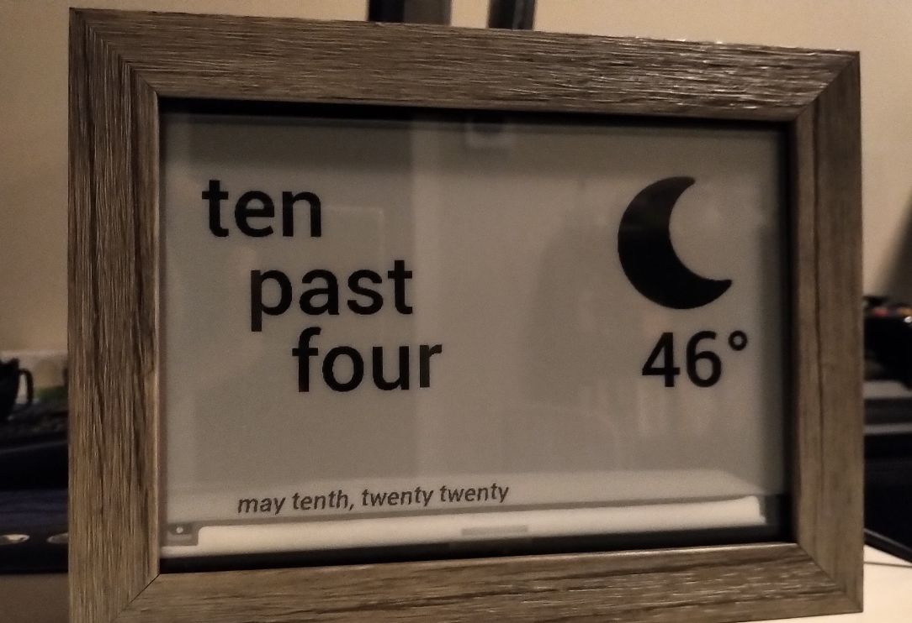

# Paperboy

*Paperboy all about that paper, boy*

E-ink clock in the style of FuzzyTime (Pebble fans know what I'm talking about).

## how to use:

1. make sure all dependencies are installed
2. insert your api-key into image.py
3. run image.py in debug mode (see flag at top), and verify that test.bmp is updating
4. connect your waveshare e-paper hat to your raspberryPi and run image.py with debug set to False
- you can run weather.py or fuzzytime.py individually to test them out
5. setup a service with system.d so it will run on startup [guide here](https://www.raspberrypi.org/documentation/linux/usage/systemd.md)

## coming soon:
- tests
- word of the day?

## design and implementation hurdles:
- testing my image creation logic at first was cumbersome, so I set a debug flag that would allow me to output an image file instead of writing to the display. This also allowed me to work from a machine that isn't the raspberryPi
- though this is a hobby project, this is the closest I've come to writing python in a production setting. Tests and Exception handling are new to my in the python space. 
- SPI was not enabled by default when I loaded raspbian onto my pi
- The first night after I framed the clock, it stopped running at some point. After opening up the frame and connecting the pi to an hdmi display I decided to enable ssh and ssh in headless mode. This has saved me a lot of time when troubleshooting, and also decreases the risk of damaging the sensitive ribbon cable for the display.

## acknowledgements

- epidif.py and epd7in5.py are provided by [Waveshare](https://github.com/waveshare/e-Paper)
- Weather using OpenWeatherMap
- Weather Icons using [FontAwesome](https://fontawesome.com/)
